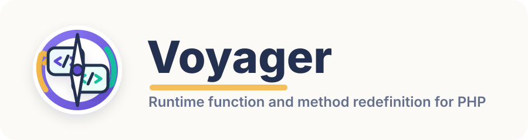
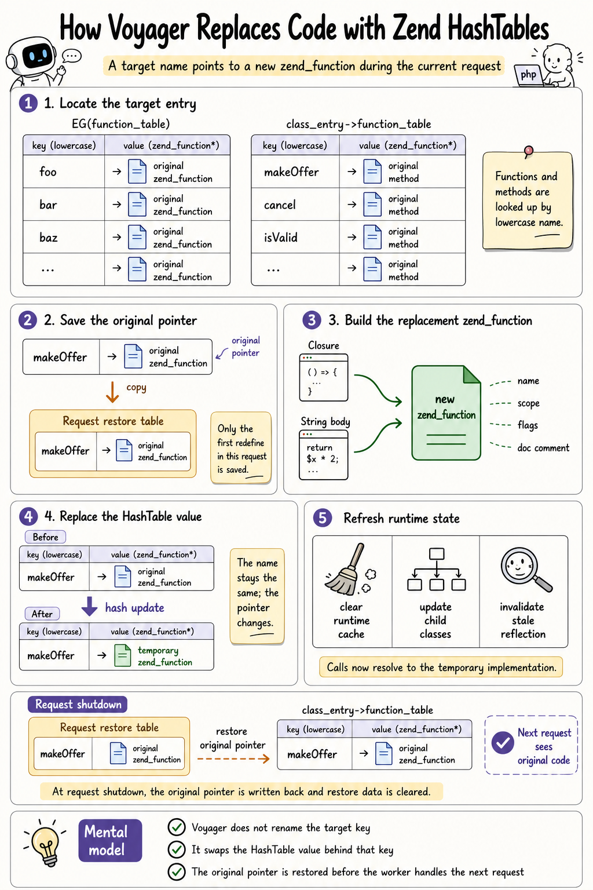

<p align="center">
  
</p>

A PHP C extension for runtime debugging in production environments. Voyager allows you to redefine existing functions and methods at runtime — useful for hot-fixing, instrumentation, and debugging live systems.

## How It Works

<p align="center">
  
</p>

## Features

- **Redefine functions** — Replace any user-defined function with a new implementation at runtime
- **Redefine methods** — Replace methods on user-defined classes, with automatic propagation to child classes
- **Closure-based API** — Use closures directly to define new implementations (full `$this` support for methods)
- **String body mode** — Pass argument lists and code as strings for dynamic code generation
- **Inheritance-aware** — Method changes on parent classes automatically propagate to all child classes
- **Reflection-safe** — Stale `ReflectionFunction`/`ReflectionMethod` objects are automatically invalidated

## Requirements

- PHP 8.0+ (tested with PHP 8.2)
- GCC or Clang
- phpize build tools

## Installation

```bash
phpize
./configure --enable-voyager
make
make install
```

Then add to your `php.ini`:

```ini
extension=voyager
```

Or load it temporarily for a single script:

```bash
php -d extension=voyager.so your_script.php
```

## Configuration

| Directive | Default | Description |
|---|---|---|
| `voyager.internal_override` | `0` | When enabled (`1`), allows redefining internal (built-in) PHP functions. |

## API Reference

### `voyager_function_redefine`

Redefine an existing user-defined function at runtime.

```php
voyager_function_redefine(
    string $function_name,
    Closure|string $closure_or_args,
    ?string $code_or_doc_comment = null,
    ?bool $return_by_reference = null,
    ?string $doc_comment = null
): bool
```

**Closure mode:**

```php
function greet($name) {
    return "Hello, $name!";
}

echo greet("World"); // Hello, World!

voyager_function_redefine("greet", function($name) {
    return "Hi, $name! (redefined)";
});

echo greet("World"); // Hi, World! (redefined)
```

**String body mode:**

```php
voyager_function_redefine(
    "greet",
    '$name',                          // argument list
    'return "Hey, $name!";',          // code body
    false,                            // return by reference
    "/** Greets someone */"           // doc comment
);
```

---

### `voyager_method_redefine`

Redefine an existing method on a user-defined class at runtime. Method changes on parent classes automatically propagate to all child classes.

```php
voyager_method_redefine(
    string $class_name,
    string $method_name,
    Closure|string $closure_or_args,
    int|string|null $code_or_flags = null,
    int|string|null $flags_or_doc_comment = null,
    ?string $doc_comment = null
): bool
```

**Closure mode:**

```php
class UserService {
    public function findUser(int $id): array {
        // Original: query database
        return ['id' => $id, 'name' => 'from DB'];
    }
}

$service = new UserService();

// Hot-fix for debugging
voyager_method_redefine("UserService", "findUser", function(int $id): array {
    return ['id' => $id, 'name' => 'mock user'];
});

var_dump($service->findUser(1)); // ['id' => 1, 'name' => 'mock user']
```

**Accessing `$this` in redefined methods:**

```php
class Counter {
    public int $count = 0;

    public function increment(): int {
        return ++$this->count;
    }
}

$counter = new Counter();

voyager_method_redefine("Counter", "increment", function(): int {
    $this->count += 2;
    return $this->count;
});

echo $counter->increment(); // 2
echo $counter->increment(); // 4
```

**Inheritance propagation:**

```php
class BaseRepository {
    public function save($data) {
        return "Base save";
    }
}

class UserRepository extends BaseRepository {}

$repo = new UserRepository();

voyager_method_redefine("BaseRepository", "save", function($data) {
    return "New save with: " . json_encode($data);
});

// Child class automatically uses the new implementation
echo $repo->save(['name' => 'test']); // New save with: {"name":"test"}
```

**String body mode with visibility:**

```php
voyager_method_redefine(
    "MyClass",
    "process",
    '$input',                          // argument list
    'return strtoupper($input);',     // code body
    ZEND_ACC_PUBLIC                    // visibility flag
);
```

Available visibility flags: `ZEND_ACC_PUBLIC`, `ZEND_ACC_PROTECTED`, `ZEND_ACC_PRIVATE`, `ZEND_ACC_STATIC`.

Voyager operates at the Zend engine level:

1. **Function cloning** — The new implementation (from a closure or eval'd code) is deep-copied into a persistent `zend_function` structure, including opcodes, literals, and argument info.
2. **Hash table replacement** — The old function/method entry in `EG(function_table)` or the class's `function_table` is atomically replaced with the new one.
3. **Cache invalidation** — All runtime caches (`run_time_cache`) are cleared and hardcoded opcode stack sizes are recalculated to prevent stale references.
4. **Inheritance propagation** — For methods, the change cascades through the class hierarchy, updating child classes and maintaining magic method pointers.
5. **Reflection cleanup** — Stale `ReflectionFunction`/`ReflectionMethod` objects pointing to the replaced function are updated to avoid segfaults.

## Project Structure

```
voyager/
├── voyager.c            Module lifecycle (MINIT, MSHUTDOWN, RINIT, MINFO)
├── voyager_functions.c  Function redefinition + lambda generation + opcode manipulation
├── voyager_methods.c    Method redefinition + class hierarchy propagation
├── voyager_common.c     Magic method management (__get, __set, __call, etc.)
├── voyager.h            Internal header: macros, structs, declarations
├── php_voyager.h        Public header (exports zend_module_entry)
├── voyager.stub.php     PHP stub file (source for arginfo generation)
├── voyager_arginfo.h    Generated arginfo from .stub.php
├── voyager-api.php      Human-readable API documentation
├── config.m4            Build configuration
├── configure.ac         Autoconf bootstrap script
└── LICENSE              BSD 3-Clause license
```

## Warnings

- This extension modifies the PHP runtime at a low level. It is intended for **debugging and development** use.
- Redefining functions/methods that are currently on the call stack will be rejected with a warning.
- Do not use this extension in performance-critical production paths unless you understand the implications.
- Reflection objects referencing replaced functions/methods will be invalidated.

## License

MIT License. See [LICENSE](LICENSE) for details.

## Author

George King &lt;<george@betterde.com>&gt;

## Acknowledgments

Inspired by the [runkit7](https://github.com/runkit7/runkit7) project. Voyager is an independent implementation with a focused API for runtime function and method redefinition.
